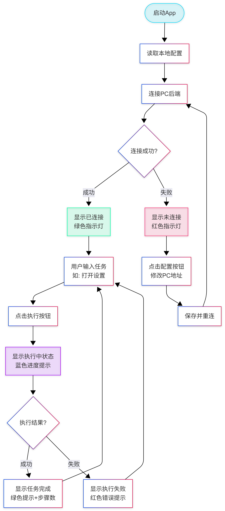
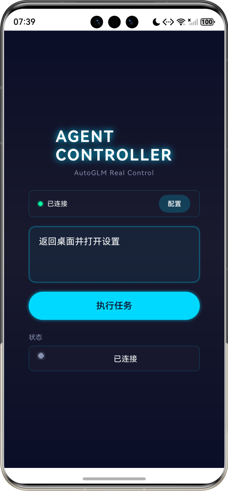
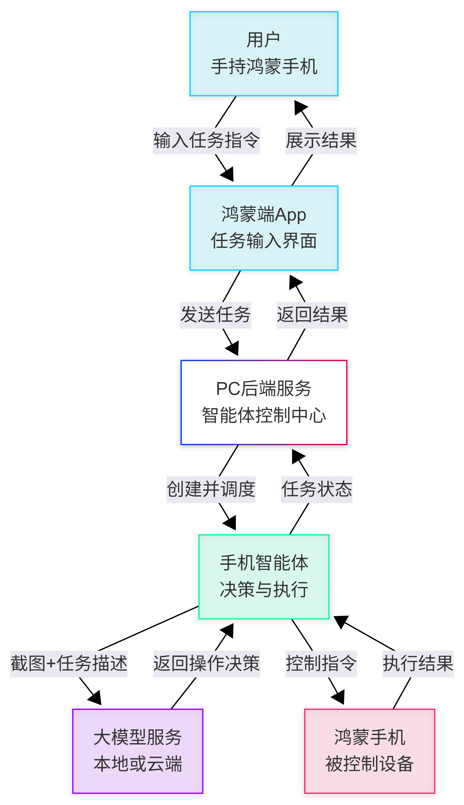
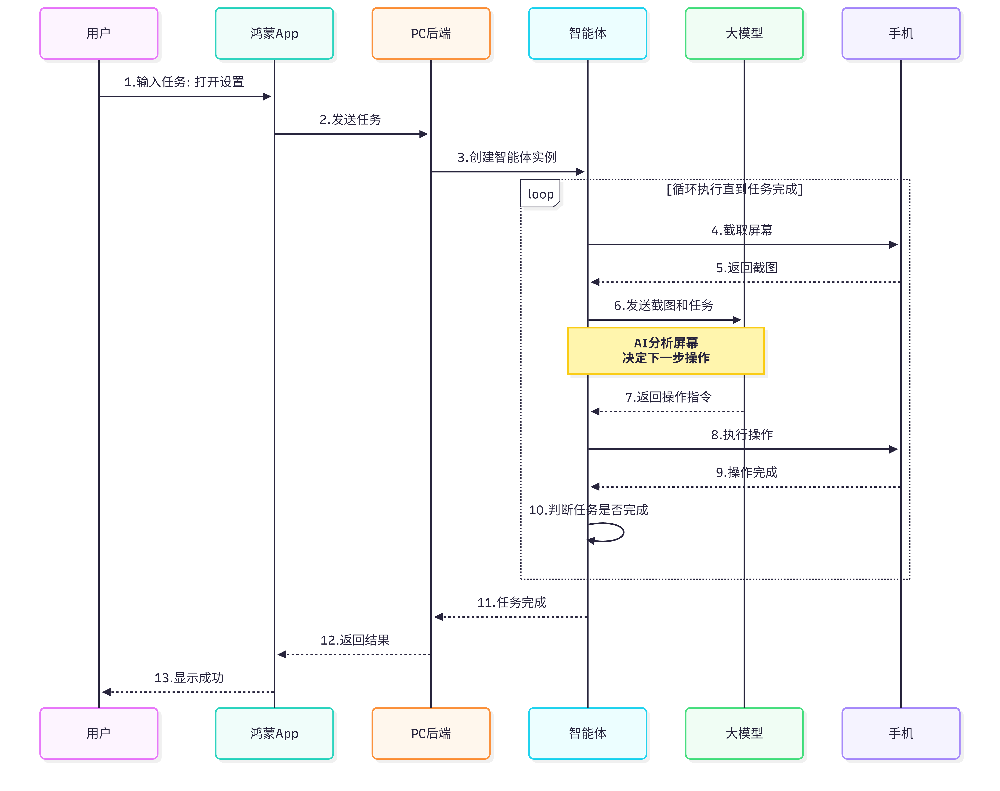
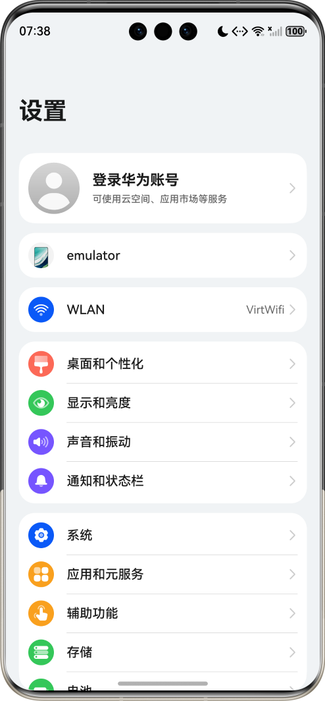
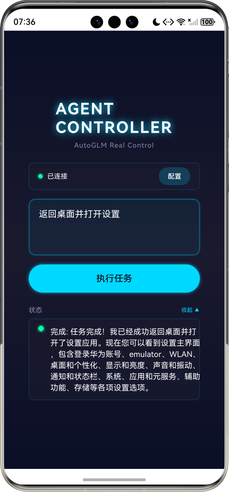

# Agent - Harmony Agent 鸿蒙客户端

**手机智能体的前端控制应用**

Agent 是 Harmony Agent 项目的鸿蒙端前端应用，运行在 HarmonyOS 设备上，为用户提供便捷的任务输入界面和实时状态展示。通过与 PC 端后端服务通信，实现自然语言控制手机的功能。

## 项目特性

### 简洁友好的界面
- **任务输入**：支持自然语言输入，如"打开设置，开启蓝牙"
- **状态展示**：实时显示任务执行状态和进度
- **结果反馈**：清晰展示执行结果和完成步骤数

### 灵活的配置
- **服务器配置**：支持自定义 PC 后端地址和端口
- **连接状态**：直观的连接状态指示器（绿色/红色）
- **持久化存储**：自动保存配置，下次启动直接使用

### 实时通信
- **HTTP REST API**：与后端服务通过标准 HTTP 接口通信
- **即时反馈**：任务执行过程实时更新状态

### HarmonyOS 原生
- **ArkTS 开发**：使用鸿蒙官方开发语言
- **原生性能**：流畅的用户体验
- **系统集成**：完美适配 HarmonyOS 设计语言

## 使用流程



### 基本步骤

1. **首次配置**：
   - 启动 App
   - 点击"配置"按钮
   - 输入 PC 后端地址（如 `http://192.168.1.100:7860`）
   - 点击"保存并重连"

2. **检查连接**：
   - 绿色指示灯表示已连接
   - 红色指示灯表示未连接，需要检查配置

3. **执行任务**：
   - 在输入框输入任务描述
   - 点击"执行任务"按钮
   - 观察手机自动执行操作
   - 查看执行结果

4. **连续使用**：
   - 完成一个任务后可立即输入新任务
   - 配置会自动保存，下次启动无需重新配置

## 快速开始

### 环境要求

- **开发工具**：DevEco Studio 5.0+
- **HarmonyOS 版本**：HarmonyOS NEXT Developer Preview 1 或更高
- **目标设备**：支持 HarmonyOS 6.0+ 的手机或模拟器

### 安装步骤

#### 方式一：使用 DevEco Studio

1. **打开项目**
   ```
   在 DevEco Studio 中打开 harmony_agent/Agent 目录
   ```

2. **配置签名**
   - 自动签名：DevEco Studio → File → Project Structure → Signing Configs
   - 选择"Automatically generate signature"

3. **连接设备**
   - 真机：开启 USB 调试并连接
   - 模拟器：启动 DevEco Studio 内置模拟器

4. **运行应用**
   - 点击 DevEco Studio 工具栏的"运行"按钮
   - 或使用快捷键：`Shift + F10`

#### 方式二：安装 HAP 包

1. **构建 HAP 包**
   ```bash
   cd Agent
   # 使用 DevEco Studio 的 hvigor 工具构建
   hvigorw assembleHap
   ```

2. **安装到设备**
   ```bash
   hdc install entry/build/default/outputs/default/entry-default-signed.hap
   ```

### 配置后端连接

应用首次启动后需要配置后端服务地址：

1. **获取 PC IP 地址**
   - Windows: `ipconfig`
   - macOS/Linux: `ifconfig` 或 `ip addr`

2. **配置应用**
   - 在 App 中点击"配置"按钮
   - 输入完整地址，格式：`http://[IP]:[PORT]`
   - 示例：`http://192.168.1.100:7860`

3. **保存并测试**
   - 点击"保存并重连"
   - 查看连接状态指示器变为绿色

## 界面说明



### 主界面元素

1. **连接状态指示器**
   - 绿色圆点：已成功连接后端服务
   - 红色圆点：未连接或连接失败
   - 状态文本：显示具体连接状态

2. **配置按钮**
   - 点击打开配置对话框
   - 可修改后端服务地址
   - 支持保存和重新连接

3. **任务输入框**
   - 输入自然语言任务描述
   - 支持多种操作类型：
     - 系统设置："打开设置，开启蓝牙"
     - 应用操作："打开浏览器，搜索天气"
     - 信息查询："查看当前时间"

4. **执行任务按钮**
   - 点击开始执行任务
   - 执行过程中显示进度状态
   - 完成后显示结果

5. **状态显示区域**
   - 执行中：蓝色进度提示
   - 成功：绿色提示 + 步骤数
   - 失败：红色错误提示

## 任务执行示例

### 系统设置类

```
打开设置，开启蓝牙
```
- 自动打开设置应用
- 导航到蓝牙设置页面
- 开启蓝牙开关

```
调高屏幕亮度
```
- 打开设置
- 进入显示设置
- 调整亮度滑块

### 应用操作类

```
打开浏览器，搜索天气预报
```
- 启动浏览器应用
- 在搜索框输入"天气预报"
- 执行搜索

```
打开计算器，计算 123 加 456
```
- 启动计算器应用
- 依次点击数字和运算符
- 显示计算结果

### 信息查询类

```
查看当前电池电量
```
- 自动导航到电池信息页面
- 显示当前电量

## 技术架构



### 通信流程



核心流程说明：
1. 用户在 App 中输入任务
2. App 通过 HTTP 发送任务到 PC 后端
3. 后端创建智能体并执行任务
4. 智能体循环"截图-决策-操作"
5. 执行完成后返回结果
6. App 显示执行状态和结果

## 项目结构

```
Agent/
├── entry/                          # 主模块
│   └── src/main/
│       ├── ets/                    # ArkTS 源代码
│       │   ├── entryability/
│       │   │   └── EntryAbility.ets    # 应用入口
│       │   ├── pages/
│       │   │   └── Index.ets           # 主界面
│       │   └── services/
│       │       └── AutoGLMService.ets  # 后端通信服务
│       ├── resources/              # 资源文件
│       │   ├── base/
│       │   │   ├── element/        # 字符串、颜色等
│       │   │   ├── media/          # 图片资源
│       │   │   └── profile/        # 配置文件
│       │   ├── en_US/              # 英文资源
│       │   └── zh_CN/              # 中文资源
│       └── module.json5            # 模块配置
├── oh-package.json5                # 依赖配置
├── hvigorfile.ts                   # 构建配置
└── build-profile.json5             # 构建配置
```

## 技术栈

- **开发语言**：ArkTS (TypeScript 超集)
- **UI 框架**：ArkUI（声明式 UI）
- **网络通信**：@ohos.net.http
- **数据存储**：@ohos.data.preferences
- **构建工具**：Hvigor

## 系统要求

- **开发环境**：DevEco Studio 6.0.1
- **运行时**：21.0.8+1-b1038.71 amd64 (JCEF 122.1.9)

- **目标设备**：
  - 真机：华为鸿蒙手机
  - 模拟器：DevEco Studio 内置模拟器

## 运行效果





## 相关项目

- [AutoGLM-GUI (PC 后端服务)](../AutoGLM-GUI/) - PC 端智能体核心